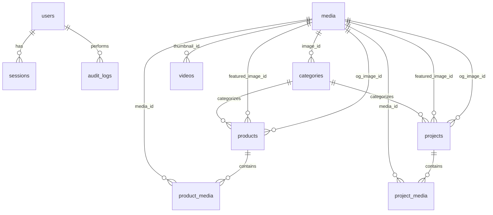

# Content Model & Database Schema — Falcon 3D Prints

## Overview

The Falcon 3D Prints database is structured in Cloudflare D1 (SQLite) with 13 relational tables supporting catalog products, workshop projects, media assets, authentication, activity audits, and dynamic content.

---

## Entity Relationship Diagram

---

## Table Schemas

### 1. `users`
- `id` (TEXT, PK): Unique admin user identifier.
- `email` (TEXT, UNIQUE): Admin email address.
- `password_hash` (TEXT): WebCrypto PBKDF2 hash (SHA-512, 100k iterations).
- `salt` (TEXT): Cryptographic 32-byte salt.
- `created_at` / `updated_at` (INTEGER): Unix epoch seconds.

### 2. `sessions`
- `id` (TEXT, PK): Session record ID.
- `user_id` (TEXT, FK -> users.id): Associated admin user.
- `token_hash` (TEXT, UNIQUE): SHA-256 hash of the session token.
- `expires_at` (INTEGER): Expiration epoch (7-day rolling window).
- `created_at` (INTEGER): Creation epoch.

### 3. `login_attempts`
- `id` (TEXT, PK): Attempt ID.
- `email_hash` (TEXT): Hashed email of the login attempt.
- `ip_address` (TEXT): Client IP (or hash).
- `success` (INTEGER): 1 if successful, 0 if failed.
- `created_at` (INTEGER): Attempt epoch (used for 15-minute rate limit calculations).

### 4. `categories`
- `id` (TEXT, PK): Category identifier.
- `slug` (TEXT, UNIQUE): URL-friendly unique slug.
- `name` (TEXT): Human-readable category label.
- `description` (TEXT): Category summary.
- `type` (TEXT): `'PRODUCT'` or `'PROJECT'`.
- `image_id` (TEXT, FK -> media.id): Cover image reference.
- `sort_order` (INTEGER): Display sequence order.
- `created_at` / `updated_at` (INTEGER): Epoch timestamps.

### 5. `media`
- `id` (TEXT, PK): Media identifier.
- `key` (TEXT, UNIQUE): Storage object key in Cloudflare R2 (`media/{id}/{filename}`).
- `filename` (TEXT): Sanitized original file name.
- `mime_type` (TEXT): MIME type (JPEG, PNG, WebP, AVIF).
- `file_size` (INTEGER): File size in bytes (max 15 MB).
- `width` / `height` (INTEGER): Image dimensions in pixels.
- `alt_text` (TEXT): Accessible image description.
- `deleted_at` (INTEGER): Soft deletion timestamp.
- `created_at` / `updated_at` (INTEGER): Epoch timestamps.

### 6. `products`
- `id` (TEXT, PK): Product ID.
- `slug` (TEXT, UNIQUE): URL slug for `/products/[slug]`.
- `title` (TEXT): Product headline.
- `short_description` (TEXT): Brief summary for cards.
- `description` (TEXT): Detailed markdown/plaintext overview.
- `category_id` (TEXT, FK -> categories.id): Associated product category.
- `price` (REAL): Base price (if publicly displayed).
- `currency` (TEXT): Currency code (`INR`, `USD`).
- `lead_time_days` (INTEGER): Production timeline in days.
- `materials` (TEXT): Comma-separated or JSON list of filaments/materials.
- `specifications` (TEXT): JSON array of `{ key, value }` pairs.
- `tags` (TEXT): Comma-separated search and filter keywords.
- `is_featured` (INTEGER): 1 for featured catalog placement.
- `sort_order` (INTEGER): Catalog sort sequence.
- `featured_image_id` (TEXT, FK -> media.id): Main thumbnail.
- `og_image_id` (TEXT, FK -> media.id): Social sharing image.
- `seo_title` / `seo_description` (TEXT): Custom meta tags.
- `status` (TEXT): `'DRAFT'`, `'PUBLISHED'`, or `'ARCHIVED'`.
- `deleted_at` (INTEGER): Soft deletion timestamp.
- `created_at` / `updated_at` (INTEGER): Epoch timestamps.

### 7. `product_media`
- `product_id` (TEXT, FK -> products.id): Associated product.
- `media_id` (TEXT, FK -> media.id): Associated media asset.
- `sort_order` (INTEGER): Gallery sequence.
- `PRIMARY KEY (product_id, media_id)`

### 8. `projects` (Workshop Wall)
- `id` (TEXT, PK): Project identifier.
- `slug` (TEXT, UNIQUE): Project slug.
- `title` (TEXT): Project title.
- `subtitle` (TEXT): Secondary subtitle / finish specification.
- `description` (TEXT): Project story and fabrication details.
- `category_id` (TEXT, FK -> categories.id): Project category.
- `is_featured` (INTEGER): 1 if featured on the public Workshop Wall (max 6).
- `sort_order` (INTEGER): Workshop Wall slot placement (1–6).
- `featured_image_id` (TEXT, FK -> media.id): Card photo.
- `og_image_id` (TEXT, FK -> media.id): Social sharing image.
- `status` (TEXT): `'DRAFT'`, `'PUBLISHED'`, or `'ARCHIVED'`.
- `deleted_at` (INTEGER): Soft deletion timestamp.
- `created_at` / `updated_at` (INTEGER): Epoch timestamps.

### 9. `project_media`
- `project_id` (TEXT, FK -> projects.id)
- `media_id` (TEXT, FK -> media.id)
- `sort_order` (INTEGER)
- `PRIMARY KEY (project_id, media_id)`

### 10. `videos`
- `id` (TEXT, PK): Video identifier.
- `title` (TEXT): Video title.
- `source_type` (TEXT): `'R2'` or `'EXTERNAL'` (YouTube, Vimeo).
- `video_url` (TEXT): External stream URL or R2 object key.
- `thumbnail_id` (TEXT, FK -> media.id): Video poster image.
- `duration_seconds` (INTEGER): Video duration.
- `sort_order` (INTEGER): Sequence order.
- `created_at` / `updated_at` (INTEGER): Epoch timestamps.

### 11. `website_content`
- `section_key` (TEXT, PK): Key (e.g. `'hero'`, `'process'`, `'about'`, `'contact'`, `'products_page'`, `'studio_settings'`).
- `content_json` (TEXT): Validated JSON object of live section fields.
- `updated_at` (INTEGER): Epoch timestamp.

### 12. `navigation_items`
- `id` (TEXT, PK): Nav item identifier.
- `label` (TEXT): Display label.
- `url` (TEXT): Target anchor or path (`/#workshop`, `/products`, `https://...`).
- `is_external` (INTEGER): 1 if external site.
- `open_new_tab` (INTEGER): 1 to open in new tab.
- `is_visible` (INTEGER): 1 if visible in header.
- `sort_order` (INTEGER): Display sequence order.
- `updated_at` (INTEGER): Epoch timestamp.

### 13. `audit_logs`
- `id` (TEXT, PK): Audit log entry ID.
- `user_id` (TEXT, FK -> users.id): Admin user who performed mutation.
- `action` (TEXT): Action name (`product.create`, `content.update`, `media.delete`).
- `target_type` (TEXT): Target entity (`product`, `project`, `website_content`).
- `target_id` (TEXT): Target record ID.
- `details` (TEXT): JSON payload of mutation details.
- `created_at` (INTEGER): Mutation epoch timestamp.
